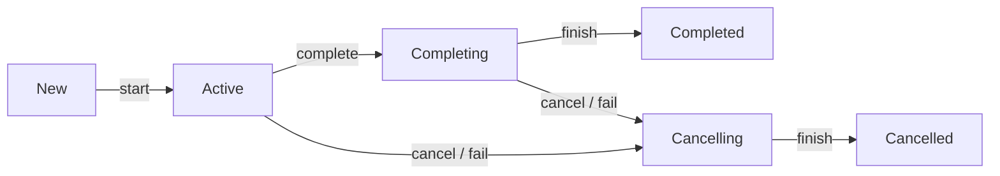

A cancellable background job with its own lifecycle

Jobs can be arranged into parent-child hierarchies, where when parent is cancelled, it leads to immediate cancellation all of its children recursively. Failure of a child with exception other than [`CancellationException`](https://kotlinlang.org/api/kotlinx.coroutines/kotlinx-coroutines-core/kotlinx.coroutines/-cancellation-exception/) immediately cancels its parent and, consequently, all its other children. This behavior can be customized using [[SupervisorJob]].